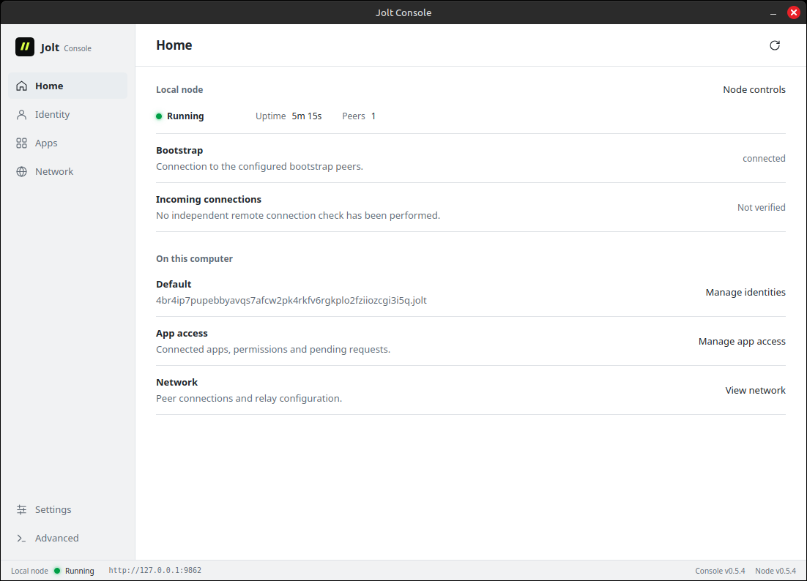
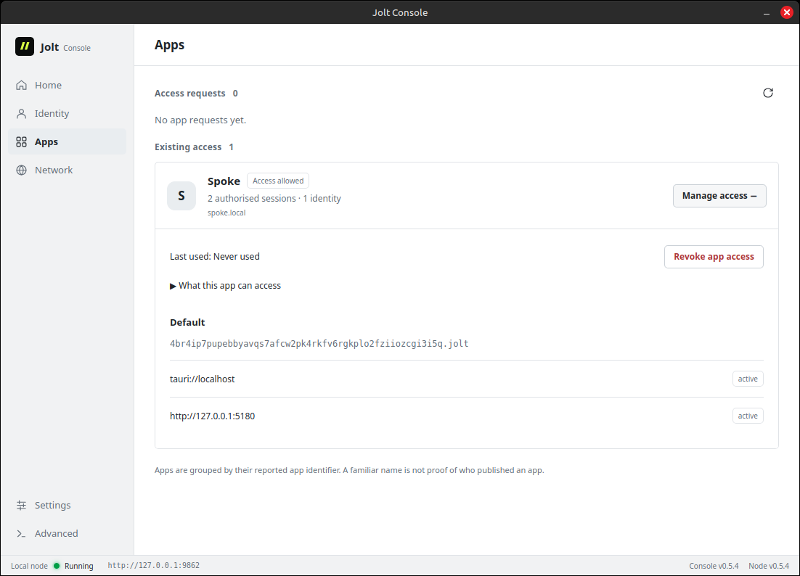

# Jolt

Jolt is a peer-to-peer network for publishing and sharing content under identities
you control.

Your local node holds your keys, stores content and connects to other nodes. Apps
request permission to use it. **Jolt Console** is the desktop app for managing your
identities, app access and node.



## Get started

Download Jolt Console, open it and start your node. Then try
[Spoke](https://github.com/alexanderwanyoike/spoke) for posts, profiles and encrypted
conversations.

| Linux                                                                                                                                                                                                           | macOS (Apple silicon)                                                                              | Windows                                                                                                       |
| --------------------------------------------------------------------------------------------------------------------------------------------------------------------------------------------------------------- | -------------------------------------------------------------------------------------------------- | ------------------------------------------------------------------------------------------------------------- |
| [.deb](https://github.com/alexanderwanyoike/jolt/releases/latest/download/jolt-console-amd64.deb) · [AppImage](https://github.com/alexanderwanyoike/jolt/releases/latest/download/jolt-console-x86_64.AppImage) | [DMG](https://github.com/alexanderwanyoike/jolt/releases/latest/download/jolt-console-aarch64.dmg) | [Installer](https://github.com/alexanderwanyoike/jolt/releases/latest/download/jolt-console-x86_64-setup.exe) |

On Debian, Ubuntu or Linux Mint, install the `.deb` with `sudo apt install ./jolt-console-amd64.deb`.
AppImage, macOS and Windows builds support signed in-app updates; `.deb` users install
the next package manually. macOS builds are not yet Apple-signed or notarized. See the
[install guide](docs/installation.md) for installer commands and troubleshooting.

<details>
<summary>App permissions in Console</summary>



Review an app's request, inspect its sessions or revoke its access. Apps do not
receive your identity's private key.

</details>

## Build on Jolt

The [TypeScript SDK](sdks/js/README.md) provides typed collections, documents and
subscriptions. Jolt handles signed identity state, content-addressed retrieval,
encryption and scoped permissions. Apps own their data models and interfaces.

This repository contains the Rust node, APIs, SDKs and Tauri Console. To run Console
from source:

```sh
yarn --cwd apps/jolt-console install
yarn --cwd apps/jolt-console tauri dev
```

You need Rust, Node.js and the [Tauri prerequisites](https://v2.tauri.app/start/prerequisites/).
The dev command builds and stages the node binary. Run `./scripts/test-local.sh`
for local verification.

For a headless node or relay, see the [install guide](docs/installation.md)
and [relay guide](docs/11-relays-and-availability.md).

## Status

Jolt is experimental and has not had a full security review. Updates propagate
between nodes over time; content stays available only while a peer or relay keeps
a copy. There is no global identity directory or search service.

[Architecture](docs/architecture.md) · [Protocol RFCs](rfcs/README.md) · [App permissions](docs/15-app-boundary-and-sessions.md) · [Releases](https://github.com/alexanderwanyoike/jolt/releases)

MIT licensed.
