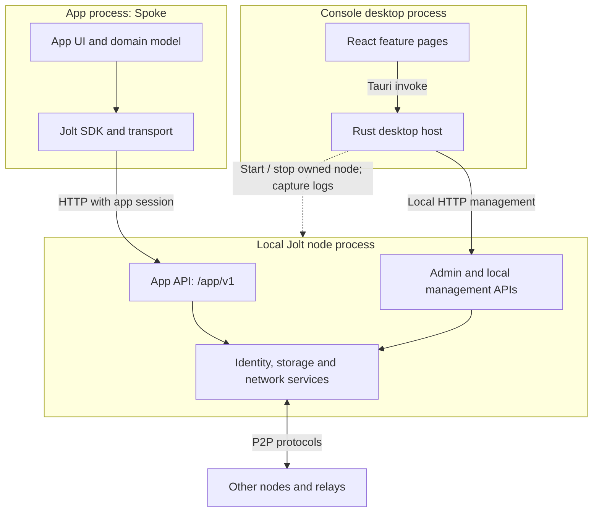
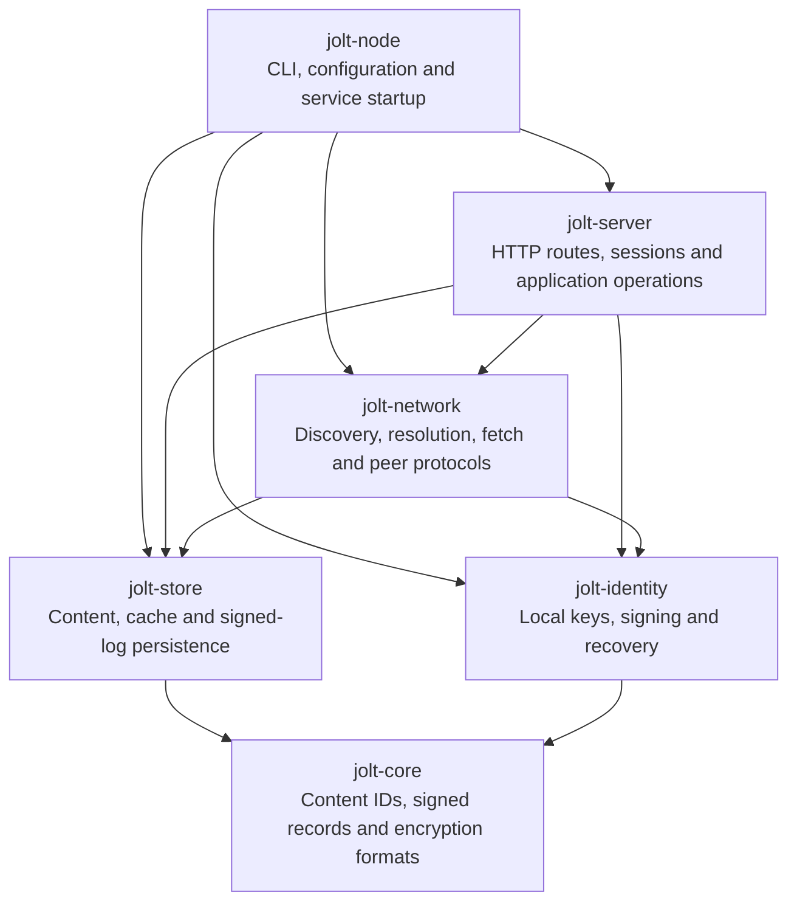
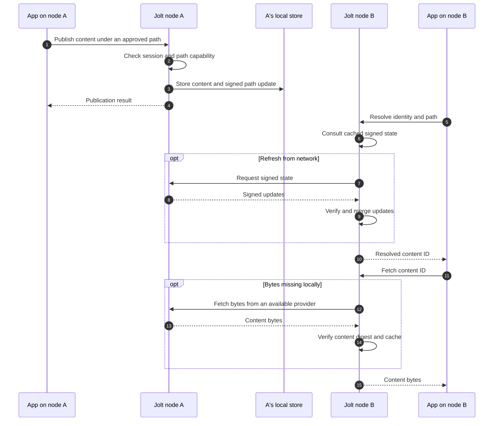
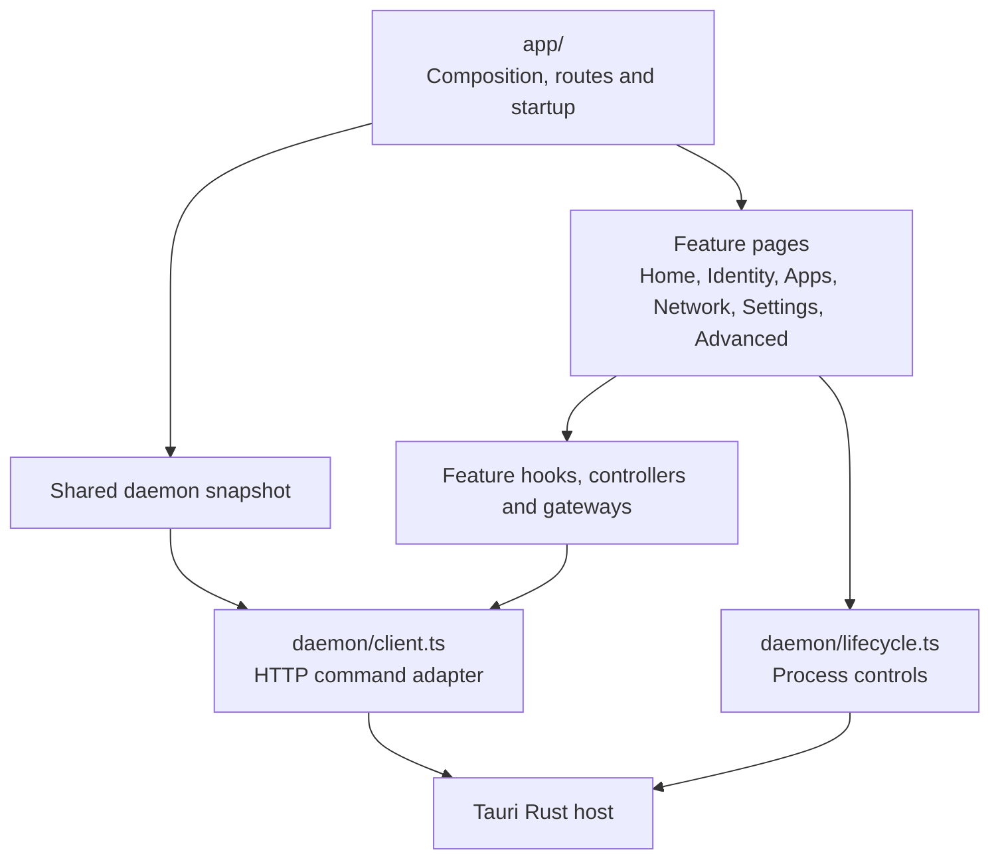

# Jolt architecture

Jolt runs a local node that holds identity keys, stores content and communicates
with peers. Console manages that node. Applications such as Spoke use a separate,
permission-scoped API and own the meaning of their content.

## Processes and trust boundaries

Console's native host can launch the bundled node or connect to an existing one.
Its lifecycle state distinguishes a node it owns from an external process. Log
capture belongs to that lifecycle layer; Console cannot assume it owns every
running node.

The App API checks sessions and capabilities for operations on behalf of an
identity. Console uses privileged local management routes to approve requests,
manage identities and change node settings. Those interfaces have different
trust assumptions. The native bridge is not an app-session authorization layer;
see [App Boundary and Sessions](15-app-boundary-and-sessions.md) for the contract.

## Node responsibilities

[`jolt-node`](../crates/jolt-node/src/daemon.rs) composes the services into one
process. The following is a responsibility map, not a complete Cargo dependency
graph.

The network crate uses libp2p with iroh integration and supports a TCP transport.
Discovery, content retrieval and relay availability are separate from the HTTP
interface used by local apps.

The protocol deals in identities, signed paths, content IDs, encrypted objects
and grants. It does not contain Spoke profiles, posts or conversations. For
example, the node can resolve an identity's signed path to a content ID without
knowing what the bytes represent.

## From an app write to a remote read

This shows one possible provider, node A. A peer or relay holding a copy may serve
it instead. Resolution can return cached state while background synchronization
runs; successful local publication does not mean every peer has observed it.
Content availability depends on reachable copies. Encrypted ingress adds a
recipient-controlled delivery path; it is separate from a public path read.

## Console code structure

Console is a fixed 1100 × 760 Tauri window. Its
[`app/App.tsx`](../apps/jolt-console/src/app/App.tsx) wires routes and injectable
clients. Feature folders own their pages, actions, styles and tests.

| Location under `apps/jolt-console/`                                                                                                                   | Responsibility                                                  |
| ----------------------------------------------------------------------------------------------------------------------------------------------------- | --------------------------------------------------------------- |
| [`src/app/`](../apps/jolt-console/src/app/)                                                                                                           | Route composition, navigation and startup                       |
| [`src/apps/`](../apps/jolt-console/src/apps/)                                                                                                         | Access requests, grouped sessions and revocation                |
| [`src/identity/`](../apps/jolt-console/src/identity/)                                                                                                 | Local identities and recovery workflows                         |
| [`src/home/`](../apps/jolt-console/src/home/), [`src/network/`](../apps/jolt-console/src/network/), [`src/relays/`](../apps/jolt-console/src/relays/) | Node overview, peers and relay settings                         |
| [`src/settings/`](../apps/jolt-console/src/settings/), [`src/update/`](../apps/jolt-console/src/update/)                                              | Appearance, node controls and signed app updates                |
| [`src/advanced/`](../apps/jolt-console/src/advanced/), [`src/diagnostics/`](../apps/jolt-console/src/diagnostics/)                                    | Advanced tools and daemon logs                                  |
| [`src/daemon/`](../apps/jolt-console/src/daemon/)                                                                                                     | Shared snapshot, native command interfaces and monitoring       |
| [`src-tauri/src/`](../apps/jolt-console/src-tauri/src/)                                                                                               | HTTP bridge, process ownership, logs and native file operations |

The shared daemon snapshot polls node facts and retains previous data on failure.
Apps has a separate controller for requests and sessions: it coordinates refresh
with mutations and backs off after failures. The Apps model groups sessions by
`app_id`, then exposes individual identities and grants. Grouping is presentation;
each session still has its own permission and revocation state.

Local React state owns dialogs and form fields. Feature controllers own workflows
that need subscriptions or coordinated refresh. Console currently uses neither
Redux/Zustand nor Spoke's form libraries. Its node-management API also differs
from the Data SDK used by applications.

## SDK and tests

[`sdks/js`](../sdks/js/README.md) exposes typed application data and lower-level
protocol operations. Its [HTTP](../sdks/js/src/transport-http.ts) and
[Tauri](../sdks/js/src/transport-tauri.ts) transports share the client contract;
[`sdks/tauri-plugin`](../sdks/tauri-plugin/) provides the native app adapter.
Schemas, collections and application-specific rules live above the protocol.

Console tests inject daemon, lifecycle and update clients. Node tests cover Rust
behavior and process boundaries; SDK tests cover transport and data contracts.
For Console changes run `yarn --cwd apps/jolt-console test`, then the relevant
build/checks and `./scripts/test-local.sh`. Documentation-only changes do not
need new behavioral tests.

For deeper implementation details, use the [node architecture reference](01-architecture.md),
[SDK guide](../sdks/js/README.md) and [protocol RFC status](../rfcs/README.md).
The [Spoke architecture guide](https://github.com/alexanderwanyoike/spoke/blob/dev/docs/architecture.md)
shows how an application uses these boundaries.
